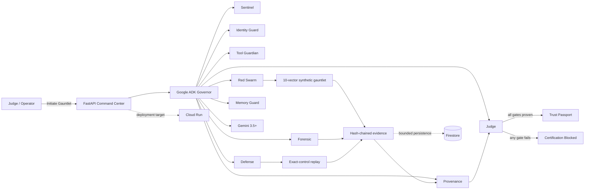

# TRUSTFORGE ZERO

**An autonomous immune system for AI agent fleets that attacks, detects, repairs, re-tests, and certifies agents before they earn the right to act.**

TRUSTFORGE ZERO is an evidence-first enterprise agent-security platform built for Google's **All Things Agentic Hackathon** and the **Fortified Enterprise Fleet** track. It is deliberately more than a chatbot: a Google ADK Governor delegates work across specialized security roles, executes a synthetic adversarial gauntlet, diagnoses failures, applies least-privilege repairs, replays the same controls, verifies provenance and runtime recovery, and issues a Trust Passport only when every mandatory gate is proven.

## Why it matters

Enterprise agents can act with tools, credentials, memory, and delegated authority. That makes failures such as indirect prompt injection, privilege abuse, poisoned tools, memory poisoning, sensitive-data egress, cascading delegation, and supply-chain drift operational security problems. TRUSTFORGE ZERO turns those risks into executable controls with fail-closed certification.

## Proof-of-action lifecycle

`DISCOVER -> ATTACK -> OBSERVE -> DIAGNOSE -> REPAIR -> RE-ATTACK -> ATTEST -> CERTIFY`

A certification run is not a scripted success animation. The backend executes evidence-producing controls and creates a SHA-256 hash-chained event trail. A positive Trust Passport requires:

- live Google ADK + Gemini evidence on the critical reasoning path;
- all 10 hardened security controls to pass on replay;
- high-risk actions to remain human-approval gated;
- verified evidence-chain continuity and provenance;
- successful fail-closed recovery/replay verification.

If a mandatory live-model, provenance, recovery, or integrity gate fails, certification is **BLOCKED**.

## Agent fleet

The Google ADK root agent is `trustforge_governor`. It delegates to nine specialists with intentionally separated responsibilities:

| Specialist | Responsibility |
|---|---|
| Sentinel | trust-boundary and policy-drift discovery |
| Identity Guard | workload identity, authorization, least privilege |
| Tool Guardian | tool/MCP schema, manifest, provenance and scope integrity |
| Red Swarm | defensive synthetic adversarial testing |
| Forensic | evidence-first root-cause analysis |
| Defense | minimum deterministic sandbox repair |
| Memory Guard | memory provenance and regression immunity |
| Provenance | independent evidence-chain attestation |
| Judge | final evidence-based Trust Passport decision |

`trustforge_zero/agent_registry.py` provides versioned first-party Agent Cards for discovery, ownership, tool/data scopes, risk tier, and approval policy. This is a project-level registry; it is **not** presented as Google Agent Registry.

## Ten-vector defensive gauntlet

1. Indirect prompt injection / goal hijack
2. Hallucination and source conflict
3. No-progress / cascading loop
4. High-risk action without human approval
5. Identity and privilege abuse
6. Tool-schema poisoning
7. Memory/context poisoning
8. Sensitive-data egress
9. Cascading delegation
10. Tool supply-chain drift

The tests are synthetic, non-destructive, and defensive. Coverage metadata maps controls to current agentic-security guidance such as OWASP Agentic AI, NIST agent security, MITRE ATLAS, and MCP security guidance.

## Google technology

**Mandatory stack used by the project**

- **Gemini 3.5+** for bounded live reasoning on the certification critical path.
- **Google Agent Development Kit (ADK) 2.x** for the Governor and multi-agent specialist architecture.
- **Google Cloud Firestore** for persistent run/evidence storage when Google Cloud credentials are available.
- The FastAPI service is designed for **Cloud Run** and exposes runtime metadata (`K_SERVICE`, `K_REVISION`) as deployment evidence when actually running there.

The application never claims Cloud Run or Firestore success from configuration alone. Cloud/runtime and persistence evidence must be observed at runtime.

## Architecture



## Reliability and operational discipline

- **Bounded model budget:** the fast path uses one critical-path live Gemini/ADK reasoning call; deterministic specialists continue executing controls without multiplying model quota.
- **Provider degradation:** if Gemini is unavailable, deterministic controls still execute, but the competition-grade Trust Passport fails closed.
- **Runtime recovery:** synthetic failure detection, isolation, checkpoint, reassignment, resume, and replay verification are explicit certification gates.
- **Persistent evidence:** Firestore writes are bounded by timeout and cannot stall security execution.
- **Human-in-the-loop:** high-risk real-world actions are never auto-approved.
- **Immutable audit evidence:** events are SHA-256 hash chained and independently re-verifiable.

## Run locally

Prerequisites: Python 3.11+ and a Gemini API key.

```bash
python -m venv .venv
source .venv/bin/activate
pip install -e .
export GEMINI_API_KEY="YOUR_KEY"
export TRUSTFORGE_MODEL="gemini-3.5-flash"
uvicorn trustforge_zero.api:app --host 0.0.0.0 --port 8000
```

Open `http://localhost:8000` and click **INITIATE GAUNTLET**. Judges do not need terminal interaction for the product demo.

Optional Google Cloud persistence uses Application Default Credentials / the Cloud Run service identity, not the Gemini API key:

```bash
export GOOGLE_CLOUD_PROJECT="YOUR_PROJECT_ID"
```

## Judge-verifiable endpoints

- `/` — one-click Command Center
- `/healthz` — health, live-model configuration, runtime metadata
- `/api/v1/agents` — specialist fleet, reliability gates, and stack evidence
- `/api/v1/registry` — versioned enterprise Agent Cards and scoped capabilities
- `/api/v1/persistence/status` — Firestore readiness evidence
- `/api/v1/gauntlet/stream` — live Server-Sent Events proof-of-action stream

## Four-minute demo path

1. Show the public Command Center and Google Cloud deployment proof.
2. Open `/api/v1/agents` or the in-product evidence panel to prove the ADK fleet and live-model gate.
3. Click **INITIATE GAUNTLET** once.
4. Show a baseline attack succeed, evidence-driven diagnosis, least-privilege repair, and the exact attack replay becoming blocked.
5. Show human approval remaining required for the high-risk action.
6. Show verified provenance/hash chain and the final Trust Passport.
7. Show Firestore persistence evidence and Cloud Run service/revision evidence if those services are active in the submitted deployment.

## Hackathon judging alignment

- **Innovation & Operational Utility:** autonomous attack -> diagnosis -> repair -> replay -> certification instead of passive chat or static scanning.
- **Architectural Discipline:** Google ADK separation of concerns, bounded model calls, scoped Agent Cards, immutable state/evidence, Firestore persistence, recovery gates, credential isolation, and fail-closed behavior.
- **Demo & Production Readiness:** one-click live SSE run, reproducible setup, architecture diagram, runtime evidence endpoints, explicit degraded states, and no fabricated cloud-success claims.
- **Fortified Enterprise Fleet:** multi-agent delegation, enterprise discovery metadata, identity/tool/memory governance, observability evidence, safe synthetic enterprise data, human gates, and continuous regression-oriented security posture.

## Safety and disclosure

TRUSTFORGE ZERO attacks only its synthetic defensive sandbox in this demo. It does not target external systems. Synthetic/deidentified procurement data is used. Security framework labels are coverage metadata, not third-party certification. Google Cloud features are claimed as active only when runtime evidence proves they are active.

## Repository map

- `trustforge_zero/agent.py` — Google ADK Governor and specialist agents
- `trustforge_zero/agent_registry.py` — versioned enterprise Agent Cards
- `trustforge_zero/parallel_adk.py` — quota-aware live ADK reasoning path
- `trustforge_zero/security_engine.py` — deterministic gauntlet, repair, replay, Trust Passport
- `trustforge_zero/resilience.py` — recovery drill and fail-closed gate
- `trustforge_zero/events.py` — immutable hash-chained evidence
- `trustforge_zero/evidence_store.py` — bounded Firestore persistence
- `trustforge_zero/api.py` — live API and SSE orchestration
- `web/` — judge-facing one-click Command Center
- `tests/` — deterministic security/recovery tests
